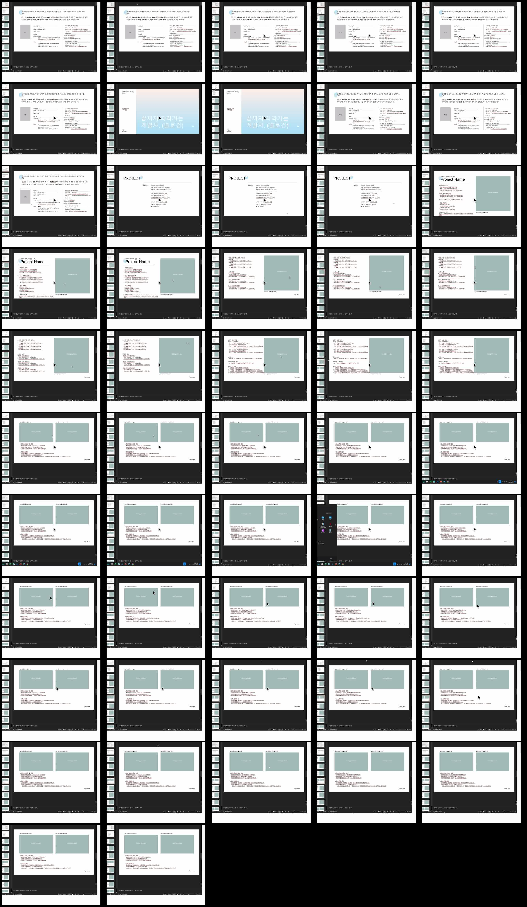
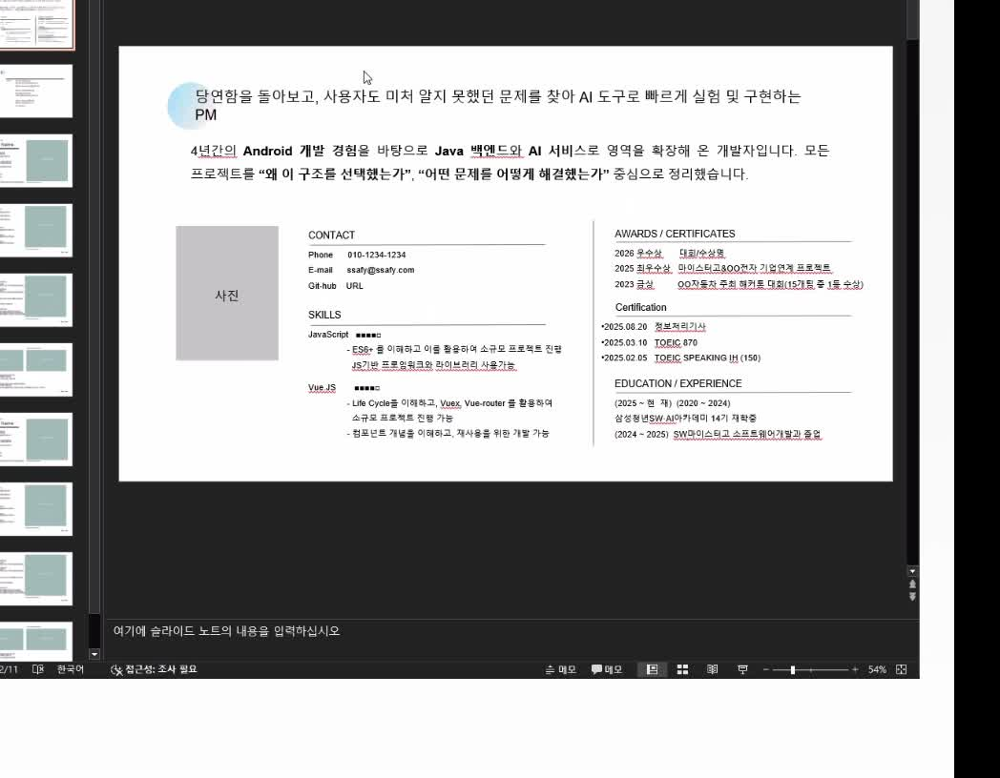
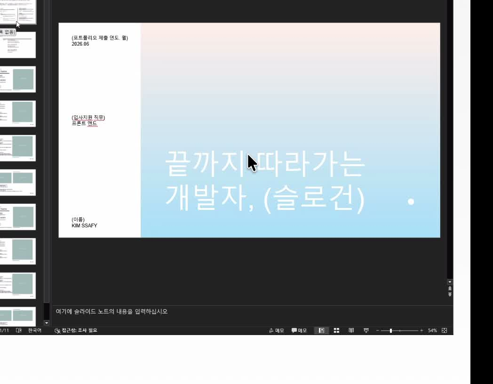
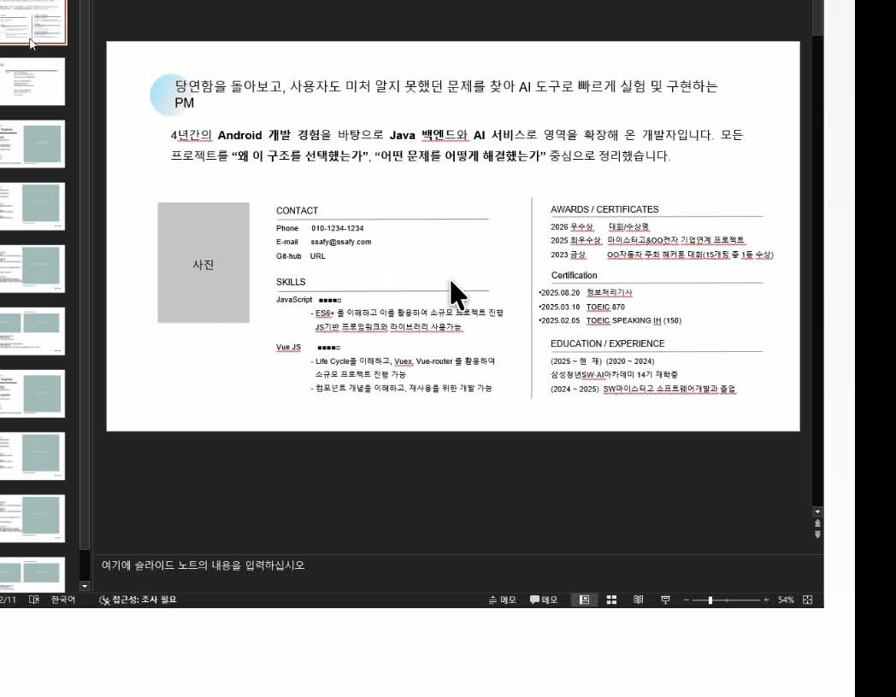
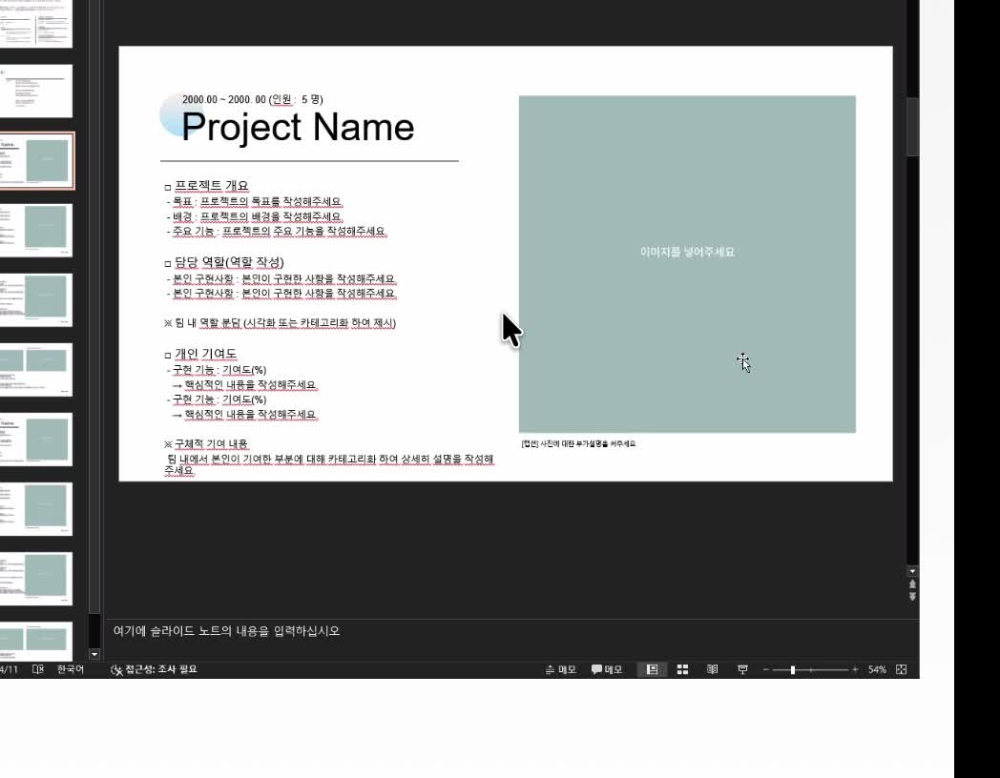
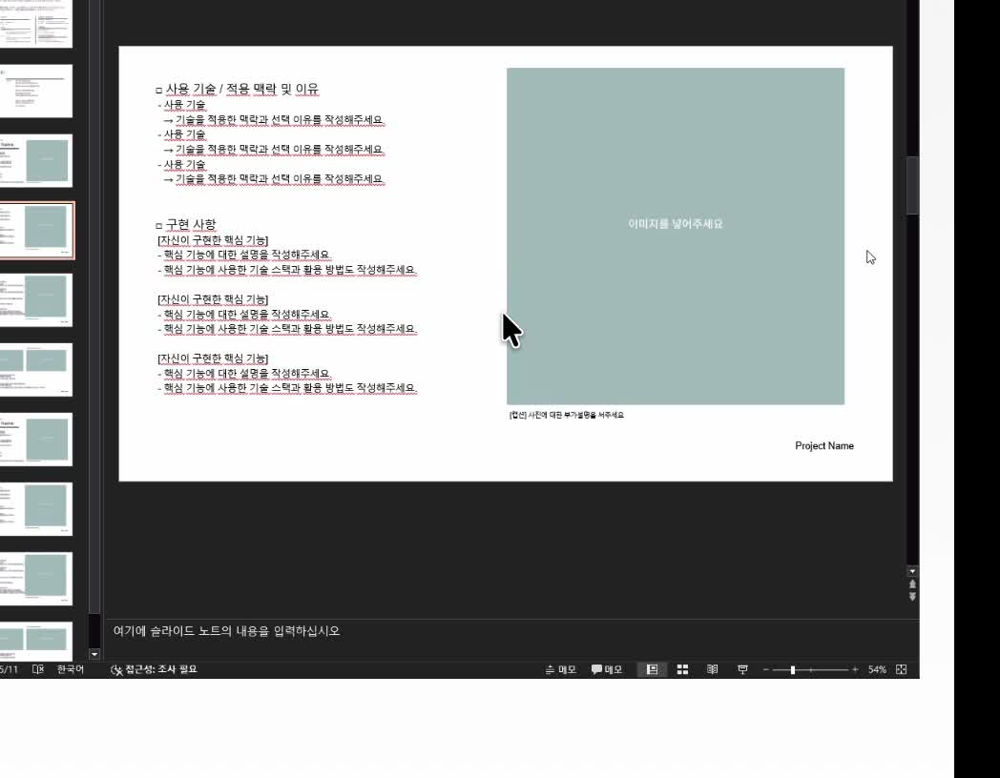
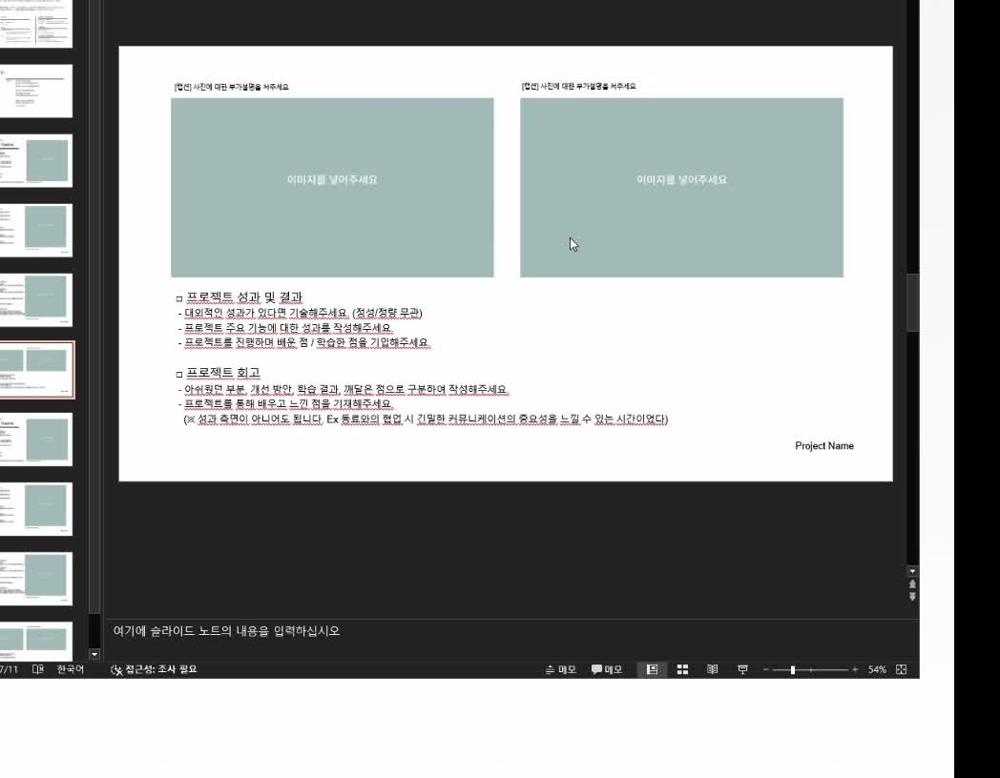

# 포트폴리오 피드백 영상 슬라이드 캡처

## 원본과 읽는 범위

- 원본: `/Users/dahyeon/Desktop/취업박람회/포폴 피드백.mov`
- 길이: 52초
- 캡처 기준: 화면에 실제로 표시된 PowerPoint 슬라이드와 좌측 슬라이드 목록을 1초 간격으로 전부 훑은 뒤, 레이아웃이 달라지는 장면을 추렸습니다.
- 주의: 이 문서는 영상의 화면 구성만 기록합니다. 회의 음성 전체를 받아 적거나 발표자의 표현을 인용한 문서는 아닙니다.

## 전체 전환 접수표

아래 이미지는 영상 전체를 1초 간격으로 캡처한 접수표입니다. PowerPoint의 좌측에 11장 슬라이드가 보이며, 영상에서 실제로 큰 화면으로 열린 레이아웃을 아래에 따로 정리했습니다.

## 화면에 표시된 슬라이드 캡처

### 01. 기존 포트폴리오 피드백 화면

기존 결과물을 두고 프로젝트 경험을 어떤 순서로 풀지 확인하는 장면입니다. 웹 포트폴리오도 단순 기술 나열보다, 한 프로젝트 안의 문제와 판단을 짧은 단위로 보여주는 쪽으로 정리합니다.

### 02. 표지 구성

표지는 이름과 핵심 한 줄을 먼저 보이게 하고, 상세 이력은 아래 단계로 밀어둔 구성입니다. 현재 첫 화면도 이 우선순위를 유지합니다.

### 03. 프로젝트 목차

프로젝트를 먼저 한눈에 고르고, 상세는 프로젝트마다 같은 구조로 이어지게 하는 기준입니다. 웹의 Project Store는 이 역할만 맡습니다.

### 04. 프로젝트 소개 한 장

프로젝트명, 짧은 개요, 역할, 기술, 대표 화면을 한 장에 배치한 형식입니다. 각 프로젝트의 첫 화면은 서비스 소개와 팀·담당 범위를 여기처럼 한 번에 읽히게 합니다.

### 05. 프로젝트 성과 한 장

한 장에서 한 사례만 다룹니다. 화면 또는 도식 하나와 함께 `문제 상황 → 내가 한 판단 → 구현 → 확인한 결과`를 짧게 배치하는 기준으로 사용합니다.

### 06. 성과와 회고를 함께 배치한 한 장

이 영상에서 가장 직접적으로 참고할 화면입니다. 위에는 기능·구현을 보여주는 이미지 두 장, 아래에는 프로젝트 성과와 회고를 둡니다. 웹에서는 **Case 01·02·03 각각을 이 한 화면 단위**로 구성합니다.

### 07. 자기소개 요약

프로필, 연락처, 기술과 활동을 한 장에서 과하게 흩뜨리지 않는 레이아웃 참고용입니다.

### 08. 자기소개 상세

지원 직무와 연결되는 활동·기술을 묶어 보여주는 형식입니다. 첫 화면의 프로필·기술·수상 영역은 이 원칙만 사용하고, 문구를 그대로 가져오지는 않습니다.

## 웹 포트폴리오에 적용할 공통 규칙

1. 프로젝트 첫 화면은 서비스 한 줄, 대표 화면, 기술·팀·담당 범위를 한 화면에 배치합니다.
2. 상세는 긴 설명문이 아니라 `Case 01 → Case 02 → Case 03`으로 나눕니다.
3. Case 한 장은 위쪽의 실제 화면 또는 구현 도식 두 영역과 아래쪽의 `성과 및 결과`, `회고` 두 영역으로 통일합니다.
4. CapSure·Roundy·SAN 모두 같은 순서를 쓰되, 실제 화면이 없는 사례는 사실처럼 보이는 서비스 캡처를 만들지 않고 구현 흐름 도식으로 대체합니다.
5. 수치와 역할은 프로젝트별 증빙 문서에서 확인된 것만 넣습니다.

## 다음 반영 순서

1. CapSure의 결제 대사, 계약 효력, AI 검토 경계를 Case 01~03으로 분리합니다.
2. Roundy의 원자 매칭, 인증 결과 일회 소비, 현재 방 권한 검증을 Case 01~03으로 분리합니다.
3. SAN의 서버 검색, AI 입력 경계, 작업 재시도·검토를 Case 01~03으로 분리합니다.
4. 각 Case의 시각 자료는 현재 보유한 실제 화면·검증 도식만 사용합니다.
